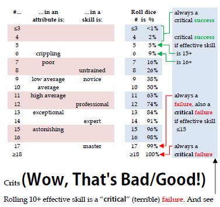

An 18 is always a critical failure.  
A 17 is a critical failure if the target is 15 or less. Otherwise it's a simple failure.  
Any miss by 10 or more is a critical failure.  
A 3 and 4 are always critical successes.  
A 5 is a critical success if your target was 15.  
A 6 is a critical success if your target was 16 or more.

This is per  

[iiiii](../Lore/plants/Silverleaf.md)

[Silverleaf](../Lore/plants/Silverleaf.md)
eeeee

crit failure

 
Random Side Effects Table B479  
Human/Humanoid Hit Location Table B552  
Non-human Hit Location Tables B552..B553  
 

Critical Hit Table 
Critical Head Blow Table  
Critical Miss Table  
Unarmed Critical Miss Table 
Reaction Table B560..B561  
  
Curses Table DF8:51  
Critical Spell Failure Table   
